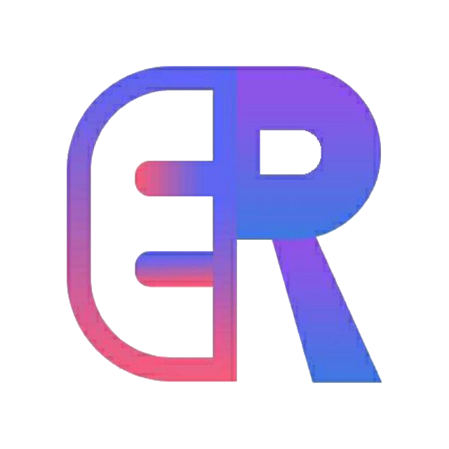

<h1>
  

     
    <b>
      ERbot SDK
    </b>
  

</h1>

<h3>
  

    面向现代 C++ 的ERbot框架插件开发工具
  

  

    
    
    
  

  

    兼容ERbot框架 v1.1.0 和 ERbot框架官方易语言 SDK v1.0.0
  

  

    <b>
      <a href="https://github.com/XC-Hsm/ERbotC-SDK/wiki">
        教程和文档
      </a>
    </b>
  

</h3>

---

## 提示

此 SDK 可能存在漏洞，请您谅解。如果您遇到问题可以尝试：

- 再次仔细阅读 [SDK 文档](https://github.com/XC-Hsm/ERbotC-SDK/wiki/) 尤其是 [参考](https://github.com/XC-Hsm/ERbotC-SDK/wiki/参考) 中的相关内容。

- 提交 [Issue](https://github.com/XC-Hsm/ERbotC-SDK/issues) 或 [PR](https://github.com/XC-Hsm/ERbotC-SDK/pulls)，感谢您的贡献！

- 加入 ERbot C++ SDK 开发 QQ 群（347010035）与我们讨论。

## 版权

ERbot C++ SDK 使用 [MIT License](./LICENSE) 进行许可

版权所有 &copy; 2020 Contributors of ERbot C++ SDK

ERbot C++ SDK 中的部分逻辑借鉴了 [Cornerstone SDK](https://www.xiaolz.cn/)、[QQMini SDK](https://qqbot.coding.net/public/qqmini/QQMiniV2Cpp/git/)

`src/sdk/util/` 目录下的 `json.hpp` 来源于 [JSON for Modern C++](https://github.com/nlohmann/json)，使用 [MIT License](https://github.com/nlohmann/json/blob/develop/LICENSE.MIT) 进行许可，版权属于 &copy; Niels Lohmann

## 致谢

- [ERbot框架](https://www.xiaolz.cn/)

- [Cornerstone SDK](https://github.com/Sc-Softs/CornerstoneSDK)

- [QQMini SDK](https://qqbot.coding.net/public/qqmini/QQMiniV2Cpp/git/)

- [JSON for Modern C++](https://github.com/nlohmann/json)

- [Visual Studio](https://visualstudio.microsoft.com/vs/)

- [Visual Studio Code](https://code.visualstudio.com/) 和插件

- [tdm-gcc](https://jmeubank.github.io/tdm-gcc/)